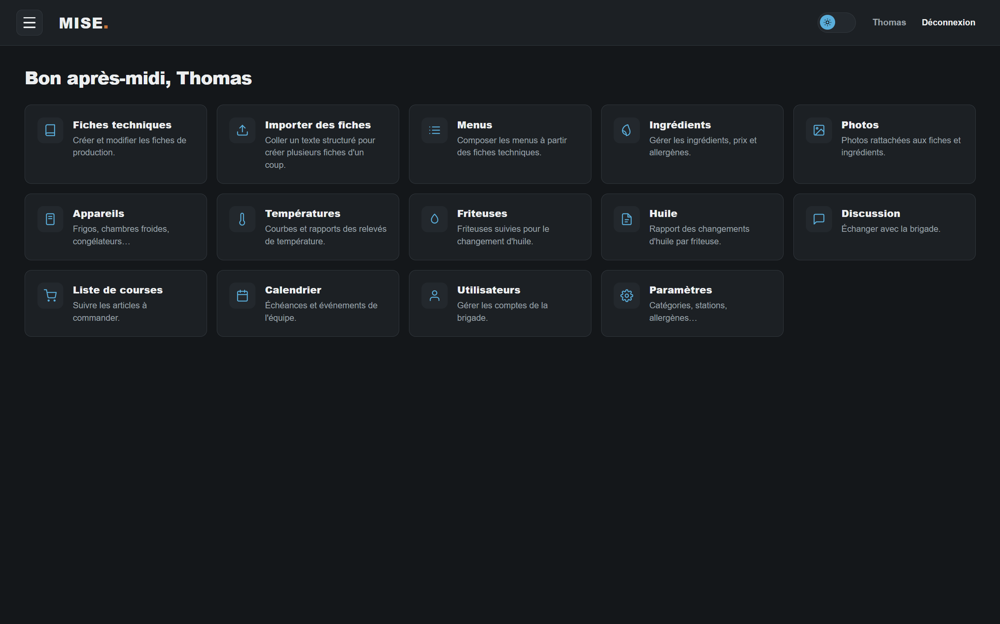
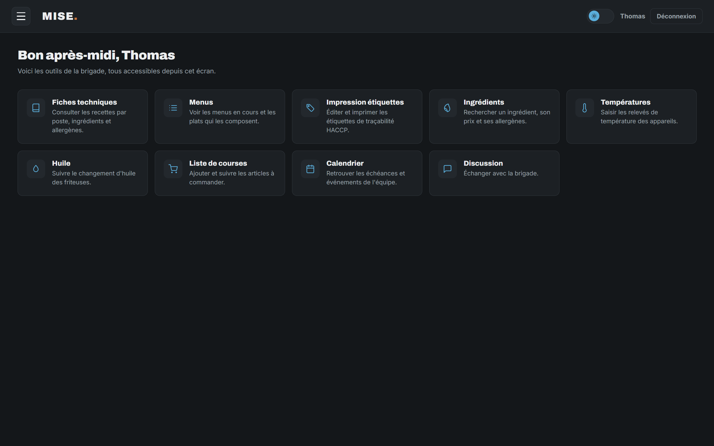

# MISE

MISE est un outil de cuisine professionnelle développé par un cuisinier, pour son propre usage
en cuisine et celui de sa brigade — fiches techniques, traçabilité HACCP, menus, étiquetage.
Ce n'est pas un produit commercial : les choix techniques restent volontairement simples et
motivés par des besoins concrets de service, pas de la sur-ingénierie.

## Aperçu

| Dashboard (back-office) | Public (brigade) |
|---|---|
|  |  |

## Architecture

Le projet est composé de trois applications indépendantes (pas d'outillage monorepo, pas de
workspace partagé) :

| Dépôt | Rôle |
|---|---|
| [`mise-api`](./mise-api) | Backend Laravel — API REST consommée par les deux frontends. |
| [`mise-dashboard`](./mise-dashboard) | Back-office Angular utilisé par le chef pour gérer le référentiel (fiches techniques, menus, ingrédients, utilisateurs...). |
| [`mise-public`](./mise-public) | Application Angular (PWA) utilisée en cuisine au quotidien par la brigade : consultation des fiches/menus et impression d'étiquettes de traçabilité. |

Les deux frontends consomment la même API via des services HTTP, chacun avec ses propres modèles
TypeScript (pas de package partagé entre les deux).

## Fonctionnalités

- **Fiches techniques** : ingrédients (avec sous-groupes), étapes, matériel, HACCP, conservation, photos, coût matière (food cost) et mise à l'échelle des portions.
- **Menus** composés de sections et de plats, un plat pouvant combiner plusieurs fiches techniques.
- **Import/export markdown** des fiches techniques (coller plusieurs fiches d'un coup, généré par exemple par une IA).
- **Impression d'étiquettes HACCP** (Ouvert le / Produit le / Congelé le / Décongelé le / Jeter le), avec intégration imprimante thermique Brother QL directement depuis le navigateur.
- **Suivi de température** des appareils (frigos, chambres froides...) avec courbes et rapports.
- **Suivi du changement d'huile** des friteuses.
- **Discussion interne**, **liste de courses** partagée et **calendrier d'événements**.
- **Authentification par rôles** (`user` / `admin`) via Laravel Sanctum.

Le détail de chaque fonctionnalité est documenté dans le README de l'application concernée.

## Démarrage rapide (Docker)

```bash
cp .env.example .env
# ajuster les valeurs si besoin (mots de passe, ADMIN_NAME/ADMIN_PASSWORD...)
docker compose up -d --build
```

| Service | URL |
|---|---|
| API | http://localhost:8000 |
| Dashboard (back-office) | http://localhost:8081 |
| Public (brigade) | http://localhost:8082 |
| phpMyAdmin | http://localhost:8083 |

Au premier démarrage, un compte administrateur est créé automatiquement à partir de
`ADMIN_NAME`/`ADMIN_PASSWORD` — changez son mot de passe depuis la gestion des utilisateurs du
dashboard une fois connecté. Les migrations et le seed du référentiel (catégories, stations,
allergènes...) tournent automatiquement à chaque démarrage du conteneur `api` (sans danger,
idempotent).

## Développement

Pour travailler sur un dépôt en particulier (serveur de dev, tests, structure du code), voir son
propre README :

- [mise-api/README.md](./mise-api/README.md)
- [mise-dashboard/README.md](./mise-dashboard/README.md)
- [mise-public/README.md](./mise-public/README.md)

`CONTEXT.md`, à la racine, rassemble le contexte détaillé du projet (modèle de données,
conventions, ce qui existe déjà, ce qui manque) — utile pour reprendre le développement ou pour
un assistant IA sans avoir à ré-explorer tout le code.

## Statut

Projet personnel, en développement actif, pensé pour un usage interne plutôt que pour une
distribution publique — pas de licence particulière choisie à ce jour.
