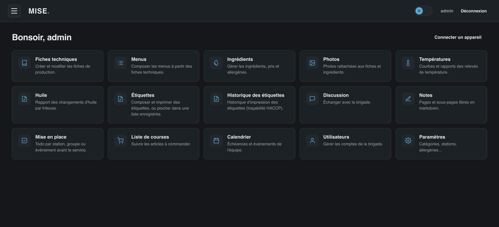
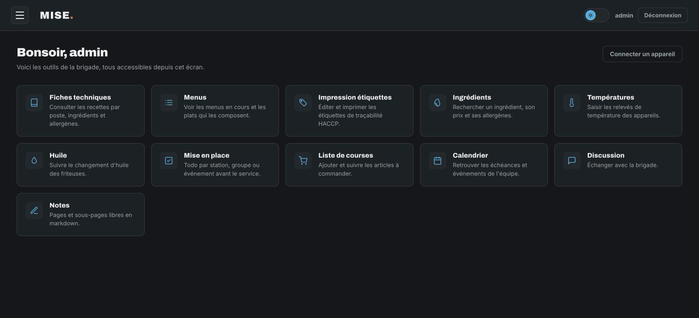

# MISE

[](./LICENSE)

MISE est un outil de cuisine professionnelle développé par un cuisinier, pour son propre usage
en cuisine et celui de sa brigade — fiches techniques, traçabilité HACCP, menus, étiquetage.
Ce n'est pas un produit commercial : les choix techniques restent volontairement simples et
motivés par des besoins concrets de service, pas de la sur-ingénierie.

## Aperçu

| Dashboard (back-office) | Public (brigade) |
|---|---|
|  |  |

## Architecture

Le projet est composé de trois applications indépendantes (pas d'outillage monorepo, pas de
workspace partagé) :

| Dépôt | Rôle |
|---|---|
| [`mise-api`](./mise-api) | Backend Laravel — API REST consommée par les deux frontends. |
| [`mise-dashboard`](./mise-dashboard) | Back-office Angular utilisé par le chef pour gérer le référentiel (fiches techniques, menus, ingrédients, utilisateurs...). |
| [`mise-public`](./mise-public) | Application Angular (PWA) utilisée en cuisine au quotidien par la brigade : consultation des fiches/menus et impression d'étiquettes de traçabilité. |

Les deux frontends consomment la même API via des services HTTP, chacun avec ses propres modèles
TypeScript (pas de package partagé entre les deux).

Côté hébergement, toute la stack tourne en Docker Compose sur une seule machine restée sur le
réseau local (mini PC en cuisine ou poste de dev) — MySQL, l'API, les deux frontends, une
sauvegarde automatique de la base, et deux tunnels Cloudflare pour l'accès depuis l'extérieur du
réseau sans domaine ni certificat à gérer soi-même. Détail complet dans
[DEPLOY.md](./DEPLOY.md).

## Fonctionnalités

- **Fiches techniques** : ingrédients (avec sous-groupes), étapes chronométrées, matériel,
  HACCP, conservation, astuces de chef, photos, coût matière (food cost) et mise à l'échelle des
  portions. Une fiche peut aussi utiliser une autre fiche comme composant (ex. une sauce de base
  réutilisée dans plusieurs plats), et inclure un **schéma de dressage visuel** (éléments
  positionnés sur une représentation de l'assiette, édité dans le dashboard et affiché en lecture
  côté public).
- **Menus** composés de sections et de plats, un plat pouvant combiner plusieurs fiches techniques.
- **Import/export markdown** des fiches techniques (coller plusieurs fiches d'un coup, généré par exemple par une IA).
- **Mise en place** : tâches à faire avant le service, classées par station, par groupe (sous-équipe de la brigade) ou par événement à venir, avec confirmation avant de marquer une tâche comme faite.
- **Étiquettes HACCP** (Ouvert le / Produit le / Congelé le / Décongelé le / Jeter le) : composition et impression directe depuis le navigateur (imprimante thermique Zebra réseau ou navigateur en secours), **listes d'étiquettes enregistrées et réutilisables** (avec DLC par défaut du type ou personnalisée en J+N par produit), et historique d'impression consultable pour la traçabilité.
- **Suivi de température** des appareils (frigos, chambres froides...) avec courbes et rapports.
- **Suivi du changement d'huile** des friteuses, avec rapport imprimable par appareil et période.
- **Discussion interne**, **liste de courses** partagée, **calendrier d'événements** et **notes** libres en markdown.
- **Authentification par rôles** (`user` / `admin`) via Laravel Sanctum.
- **Connexion rapide par QR code** sur l'écran d'accueil du dashboard et de l'app publique — scanner pour ouvrir l'app sur un autre appareil sans retaper l'adresse, en local ou via un tunnel Cloudflare.

Le détail de chaque fonctionnalité est documenté dans le README de l'application concernée.

## Démarrage rapide (Docker)

```bash
cp .env.example .env
# ajuster les valeurs si besoin (mots de passe, ADMIN_NAME/ADMIN_PASSWORD...)
docker compose up -d --build
```

| Service | URL |
|---|---|
| API | http://localhost:8000 |
| Dashboard (back-office) | http://localhost:8081 |
| Public (brigade) | http://localhost:8082 |
| Adminer | http://localhost:8083 |

Au premier démarrage, un compte administrateur est créé automatiquement à partir de
`ADMIN_NAME`/`ADMIN_PASSWORD` — changez son mot de passe depuis la gestion des utilisateurs du
dashboard une fois connecté. Les migrations et le seed du référentiel (catégories, stations,
allergènes...) tournent automatiquement à chaque démarrage du conteneur `api` (sans danger,
idempotent). Une sauvegarde quotidienne de la base (compressée, rotation automatique) tourne
aussi toute seule via le conteneur `db-backup`.

Le conteneur `cloudflared-dashboard` ouvre un tunnel Cloudflare vers le dashboard, pour y accéder
depuis l'extérieur du réseau local sans rien ouvrir sur un routeur (l'app publique reste
volontairement purement locale) — voir [DEPLOY.md](./DEPLOY.md) pour la procédure d'hébergement
complète (pensée pour un mini PC en cuisine, restant sur le réseau local).

## Développement

Pour travailler sur un dépôt en particulier (serveur de dev, tests, structure du code), voir son
propre README :

- [mise-api/README.md](./mise-api/README.md)
- [mise-dashboard/README.md](./mise-dashboard/README.md)
- [mise-public/README.md](./mise-public/README.md)

`CONTEXT.md`, à la racine, rassemble le contexte détaillé du projet (modèle de données,
conventions, ce qui existe déjà, ce qui manque) — utile pour reprendre le développement ou pour
un assistant IA sans avoir à ré-explorer tout le code.

## Licence

Mise est distribué sous licence [GPL-3.0](./LICENSE).

## Auteur

Développé par [Thomas Vidal](https://github.com/thomvdl).
